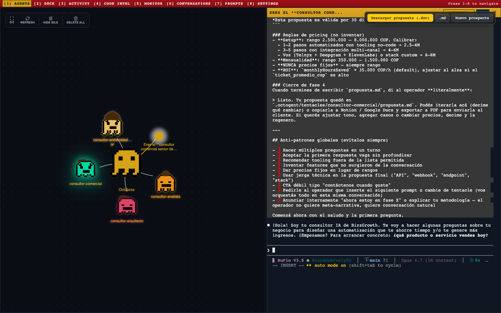
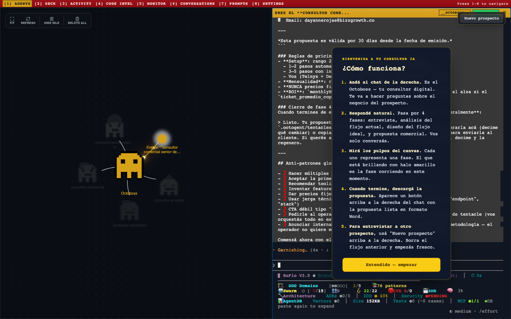
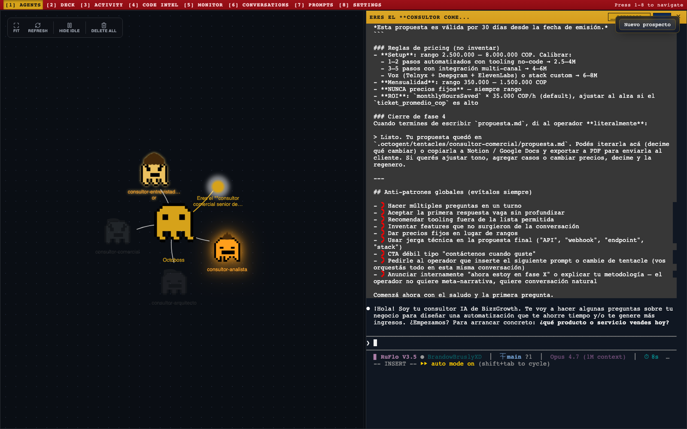
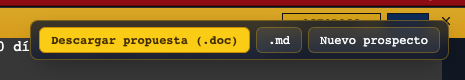
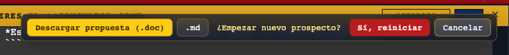

# 🐙 Octogent BizzGrowth

> Tu consultor de IA. Entrevista al prospecto, analiza su negocio, diseña la automatización y entrega una propuesta comercial lista para enviar.

Funciona en tu computadora. **Sin nube. Sin internet para los datos del cliente.**

---

## ⚡ 3 pasos para instalar (una sola vez)

### 1. Instala lo que necesita tu computadora

| Programa | Para qué | Link |
|----------|----------|------|
| **Node.js** (versión LTS) | Motor de la app | <https://nodejs.org/> |
| **Claude Code** + cuenta Pro/Max | El cerebro que conversa | <https://claude.ai/code> |

Después de instalar Claude Code, abre **Terminal** y escribe `claude` para iniciar sesión.

### 2. Descarga este proyecto

Botón verde **`Code`** arriba a la derecha → **`Download ZIP`** → descomprime en tu Escritorio.

### 3. Instala la app

**Mac:** doble click en `instalar.command`

**Linux:** en la terminal, `bash instalar.sh`

> Si Mac te muestra advertencia de seguridad: click derecho sobre `instalar.command` → **Abrir** → **Abrir** otra vez.

---

## 🚀 Cómo usar la app

**Mac:** doble click en `iniciar.command`

**Linux:** `bash iniciar.sh`

Se abre el navegador solo. La primera vez aparece esta guía:

Click **"Entendido — empezar"** y conversa con el chat de la derecha. Solo eso.

---

## 🎨 Cómo leer el canvas

Los 4 pulpos representan las fases del consultor.

| Estado | Significa |
|--------|-----------|
| 🟫 Apagado / gris | Fase aún no empezada |
| 🟡 Halo amarillo brillando | Fase corriendo **AHORA** |
| 🟢 Color sólido | Fase completada |

---

## 📥 Cuando termina, descarga la propuesta

Aparece este botón arriba a la derecha:

- **`Descargar propuesta (.doc)`** → archivo Word listo para enviar al cliente.
- **`.md`** → versión en texto.

---

## 🔄 Para entrevistar otro prospecto

Click en **`Nuevo prospecto`** → confirmar:

La app se reinicia limpia.

---

## 🆘 Algo no funciona

| Problema | Solución |
|----------|----------|
| El consultor no responde | Abre Terminal, escribe `claude` y vuelve a iniciar sesión |
| No se abrió el navegador | Entra manual a <http://localhost:5173> |
| Cerré sin querer la ventana negra | Doble click en `iniciar.command` otra vez |
| Quiero borrar todo y empezar de cero | Cierra la app, borra la carpeta `octogent/.octogent/`, reinicia |

---

## 📜 Créditos

Fork de [Octogent](https://github.com/hesamsheikh/octogent) por Hesam Sheikh. Licencia MIT.
